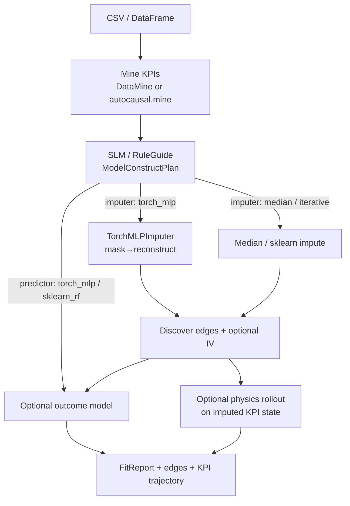

# KPI-mined ML loop (SLM → PyTorch)

AutoCausalLib can **construct** imputer/predictor choices from mined KPIs via Rule/SLM guides, then run an autocausal loop that optionally trains a small **PyTorch MLP** imputer.

See also: [AUTOCAUSAL_ML_MODEL_HUB_PROPOSALS.md](../../docs/AUTOCAUSAL_ML_MODEL_HUB_PROPOSALS.md) (hub roadmap; TF / XGBoost still proposal-only).

## Flow



## How SLM constructs PyTorch models

1. **Mine** produces `kpis`, associations, column profiles.
2. **Guides** (`rule` always; optional `huggingface` / `llmintent` / `kineteq_pivot`) emit:
   - `kpi_focus`, `outcome`, `treatment`
   - `imputer`: `torch_mlp` | `iterative` | `median`
   - `predictor`: `torch_mlp` | `sklearn_rf` | `none`
3. **`construct_model_plan`** merges guide hints with env:
   - `AUTOCAUSAL_TORCH=1` + torch installed → prefer `torch_mlp`
   - `use_torch=True` CLI/API flag forces torch when available
   - Missing torch soft-falls to median / sklearn
4. **Loop** trains `TorchMLPImputer` on numeric KPI columns (held-out mask MAE), imputes, discovers, optionally fits a tabular MLP/RF predictor, then physics rollout.

RuleGuide never downloads models. HuggingFace SLM is optional and soft-fails.

## API

```python
from autocausal.ml import KPIMinedCausalLoop

result = KPIMinedCausalLoop.from_csv("data.csv").run(
    text="what drives revenue?",
    use_slm=False,   # RuleGuide default
    use_torch=True,  # train torch MLP when [torch] installed
    horizon=5,
)
print(result.plan.to_markdown())   # ModelConstructPlan
print(result.fit.to_markdown())    # FitReport
print(result.to_markdown())
```

Or via `AutoCausal`:

```python
from autocausal import AutoCausal

ac = AutoCausal.from_csv("data.csv")
result = ac.ml_loop(text="what drives Y?", use_torch=True)
```

## CLI

```bash
python -m autocausal ml loop --csv data.csv --text "what drives Y?"
python -m autocausal ml loop --csv data.csv --torch --guides rule
python -m autocausal ml loop --csv data.csv --torch --guides rule,slm
python -m autocausal ml fit-imputer --csv data.csv --backend torch
python -m autocausal ml fit-imputer --csv data.csv --backend median
```

## Install / env

```bash
pip install -e ".[torch]"     # or .[ml] for torch+sklearn
# optional
set AUTOCAUSAL_TORCH=1        # prefer torch in construct plan
set AUTOCAUSAL_TORCH_TEST=1   # enable gated torch tests
```

## Contracts

- `shared_contracts/ModelSpec.v1.schema.json`
- `shared_contracts/FitReport.v1.schema.json`
- Package mirrors: `autocausal/ml/schemas/`

## Still proposal-only

TensorFlow hub, full XGBoost AutoML registry, large pretrained tabular foundation models — see the proposals doc. This slice ships **median / sklearn / small PyTorch MLP** only.
